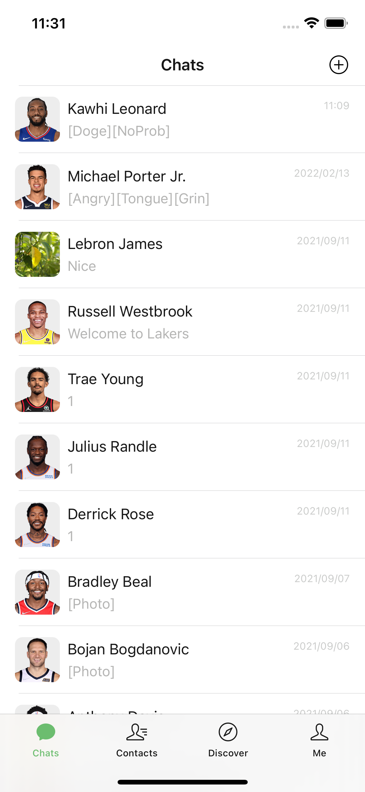
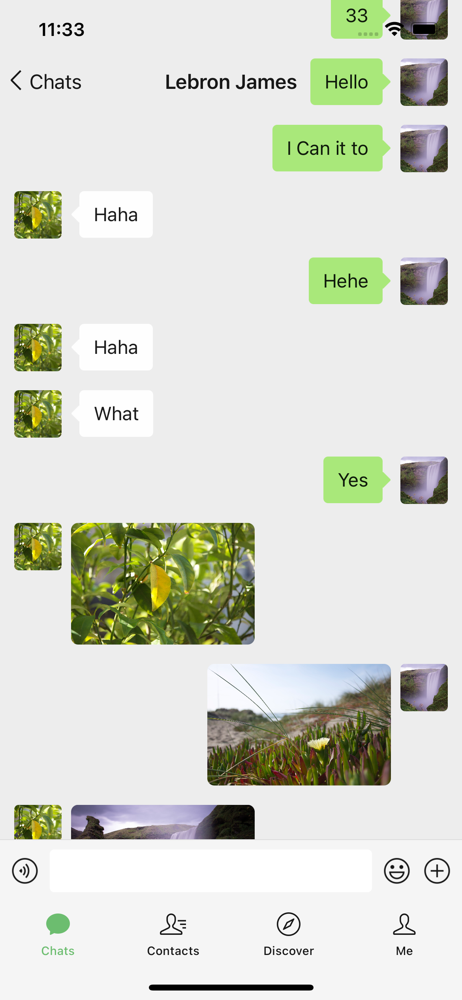
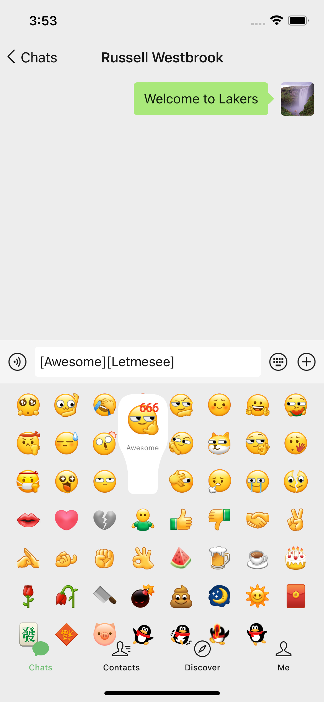
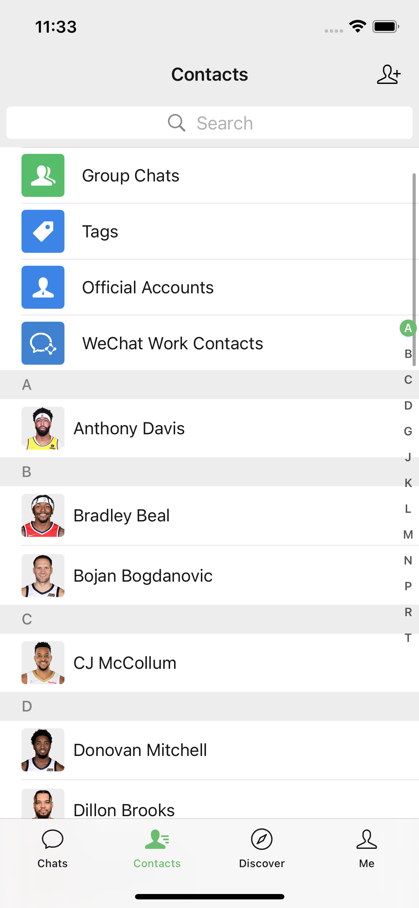
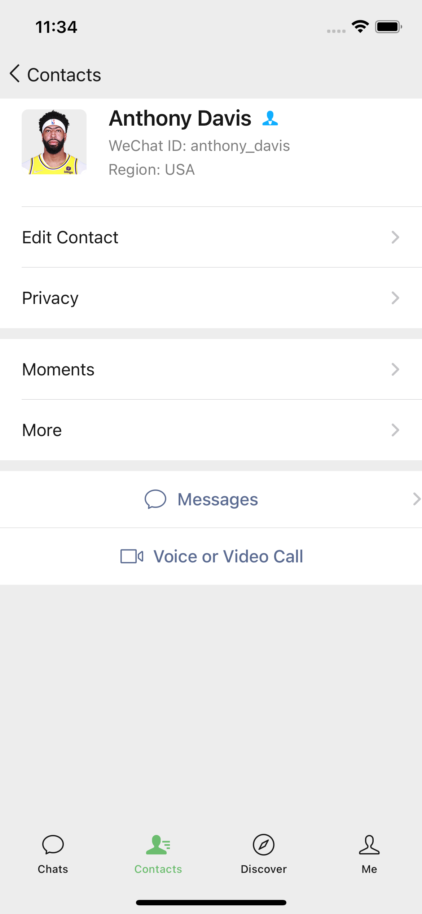
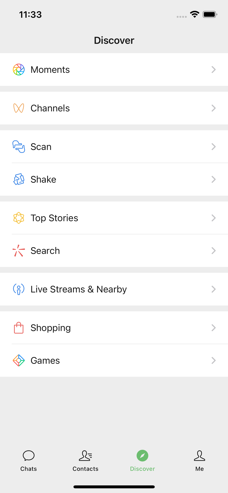
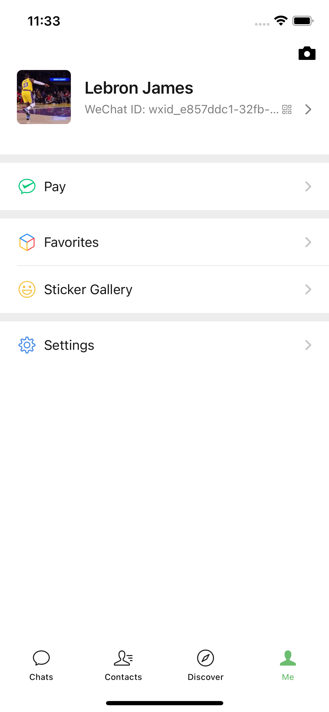
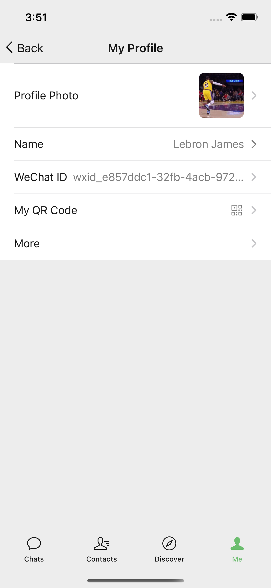

# WeChat-SwiftUI

用 SwiftUI 仿写的微信。

虽然只是一个仿写的项目，但我还是按照实际生产开发的要求去编写，而不仅仅是停留在简单的 UI 层面。

本项目的目标是尽量使用纯 SwiftUI 框架来实现。如果 SwiftUI 暂时还不支持的，我们先不实现，等 SwiftUI 支持了再实现。

## 预览图

   
   

## 核心架构 TCA

[The Composable Architecture](https://github.com/pointfreeco/swift-composable-architecture) （简称 TCA）是一个可以让你用一致和可理解的方式来构建应用的库。可用于 SwiftUI、UIKit等；并且适用于任何苹果平台（iOS、macOS、tvOS 和  watchOS）。 我已经对这个库进行了[源码解析](https://juejin.cn/post/7165326896530456613)，有兴趣可以点击查看。

## 多语言的处理

本项目多语言的处理参考了 [Kickstarter iOS](https://github.com/kickstarter/ios-oss) 中的方法。使用 `bin/strings-script` 脚本和 `ExternalResources/locales.json` 自动生成多语言文件和 `Strings` 类型。需要添加新的语句时，只需要在 `locales.json` 添加对应的翻译，然后执行 `make strings` 命令，就可以在项目中使用 `Strings.xxx()` 得到当前语种的语句。

## 单元测试

本项目包含了大量的单元测试，以保证关键逻辑的准确性。

## 第三方库

-  [SwiftUIRedux](https://github.com/Lebron1992/SwiftUIRedux)：我自己编写的 Redux 库。编写的思路可以去看我之前写的一篇文章 [《在 SwiftUI 中实现 Redux》](https://juejin.cn/post/6912251186770870286)

-  [Kickstarter-Prelude](https://github.com/Lebron1992/Kickstarter-Prelude)： 一些方便使用的 Swift 类型的扩展。我从 Kickstarter 的 [Kickstarter-Prelude](https://github.com/kickstarter/Kickstarter-Prelude) 项目拿过来的代码，制作成 Swift Package 库。

-  [URLImage](https://github.com/dmytro-anokhin/url-image)：显示网络图片。

-  [LBJMediaBrowser](https://github.com/Lebron1992/LBJMediaBrowser)：我自己编写的用于预览图片和视频的库。

## 数据的模拟

本项目的用户注册与登录、聊天、联系人和个人信息等都通过 Google 的 Firebase 实现，尽量模拟实际开发的逻辑。

## 已实现的功能

- **注册和登录**

- **聊天**
	- 私聊：可以在联系人中找实际存在的用户聊天（除 Lebron James 外，其他NBA 球员是假数据）
	- 可以发送文字、图片和表情
	- 点击图片查看大图

- **联系人**
	- 列表
	- 使用右边的索引滚动列表
	- 搜索
	- 详情页

- **发现**
	- 列表

- **我**
	- 查看和修改个人信息：头像、名字、性别和个性签名。

## 运行项目

本项目因为使用了 Google 的 Firebase，所以中国大陆用户运行前请连接 VPN。

## 添加新功能

如果您乐意为本项目添加新功能，我非常欢迎。请使用 GitHub Issues 写出自己想要做的功能，实现以后提交 PR。

我有代码洁癖，很注重代码的简洁性和可读性。在写代码的时候请按照我的风格来。如果觉得在代码中有地方可以改进的，欢迎指出。谢谢！
